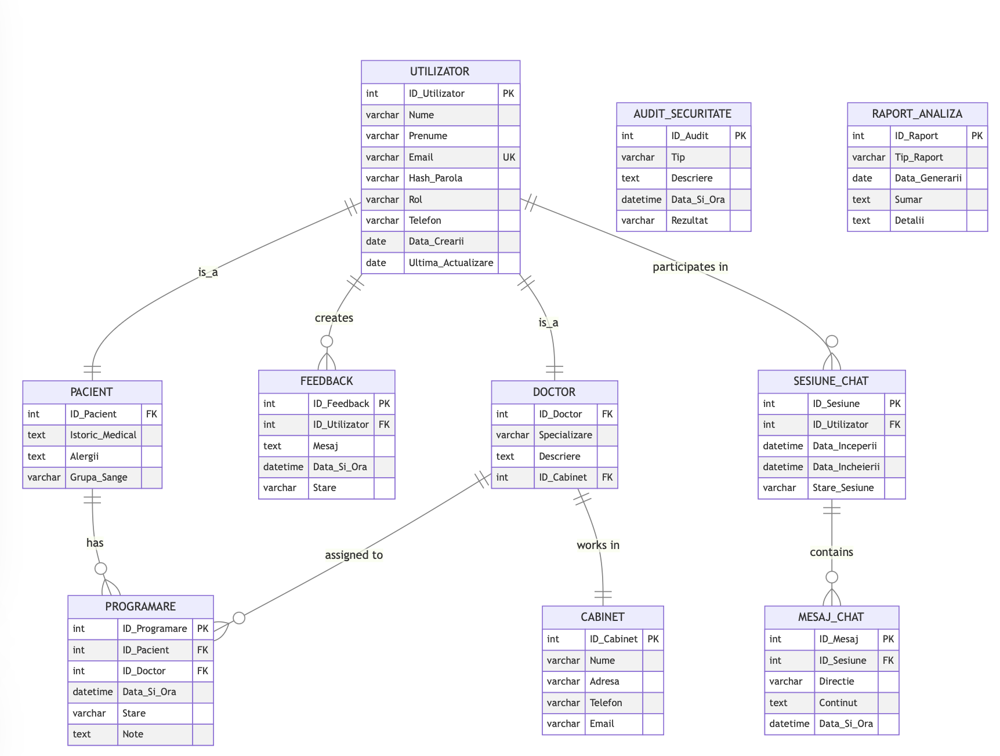

# Asistent Medical MDS-P

MDS-P este o aplicație minimalistă creată pentru clinici, oferind utilizatorilor un asistent medical personal. Această aplicație își propune să simplifice interacțiunea utilizatorilor cu serviciile medicale, eliminând necesitatea unei interfețe tradiționale bazate pe butoane. Indiferent de vârstă sau profesie, orice persoană poate naviga și interacționa ușor cu asistentul pentru a primi sfaturi medicale personalizate și pentru a accesa informații despre clinică și doctori.

## Demo

Urmărește un demo al aplicației pe [YouTube](https://www.youtube.com/watch?v=Bxp8uW8uVl8).

## Puncte atinse

1. [User Stories](./documentation/user_stories.md)
2. [Instrument AI](./documentation/ai_tool.md)
3. [Pattern de Design](./documentation/design_pattern.md)
4. [Standarde de Cod](./documentation/code_standards.md)
5. [Flux de Lucru](./documentation/workflow.md)

## Caracteristici

- **Sfaturi Medicale Personalizate**: Asistentul oferă sfaturi medicale adaptate pe baza istoricului medical și stării de sănătate actuale a utilizatorului.
- **Informații despre Clinici și Doctori**: Utilizatorii pot accesa informații detaliate despre clinică și doctori.
- **Programare Ușoară**: Utilizatorii pot programa rapid și ușor întâlniri cu doctorii preferați.
- **Înregistrare și Logare**: Utilizatorii se pot înregistra pe platformă și se pot loga pentru a accesa toate funcționalitățile asistentului medical.

## Tehnologie și Arhitectură

- **Backend API**: Backend-ul aplicației este construit ca un microserviciu folosind Java, care comunică cu scripturile de Python.
- **Integrare Llama API**: Scriptul Python se folosește de API-ul Llama pentru a procesa și răspunde întrebărilor utilizatorilor. Mai multe detalii despre Llama API găsiți [aici](https://github.com/ollama/ollama/blob/main/docs/api.md).
- **Microservicii**: Atât Llama, cât și backend-ul Java sunt implementate ca microservicii pentru această aplicație.
- **Bază de Date**: Aplicația folosește o bază de date SQL pentru stocarea datelor, reprezentată printr-o diagramă UML.

### Schema Logică a Aplicației

### Diagramă UML (Bază de Date)

